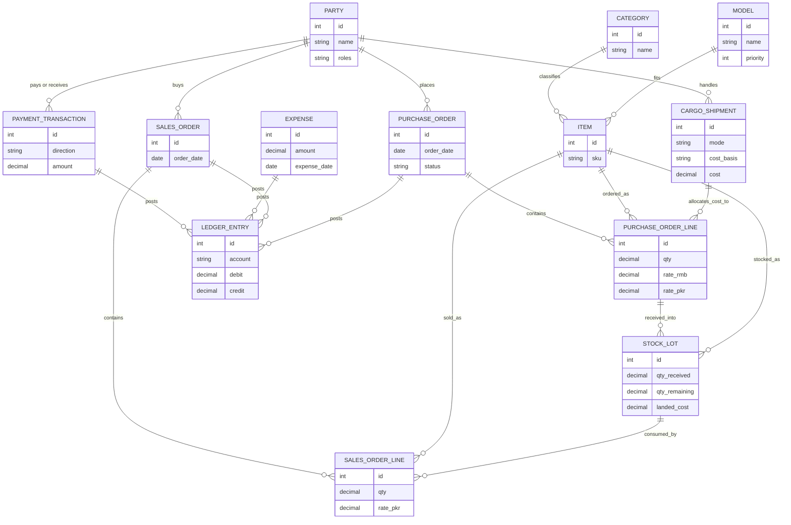

# Trading System — Build Plan

China-to-Pakistan mobile accessories trade · FastAPI + PostgreSQL + Pydantic (backend) · React + Yup (frontend) · single user for now

A phased plan for a system covering purchasing, cargo, inventory, sales, parties, payments, expenses, and reporting — built so each phase is a usable tool on its own, not a piece of an unfinished whole.

## Principles behind this plan

1. **Every phase ships something you'll actually use.** No phase is "just backend" or "just database." Each one ends with a screen you open the next morning to run part of the real business — that's what keeps a solo build from stalling.

2. **One "party" concept, not four separate ones.** A China vendor, a cargo agent, a wholesale customer, and a local vendor are all just contacts with money flowing one or both directions. Model one `Party` with roles, not four tables — a local vendor who both sells to you and buys from you shouldn't need two records.

3. **"Dynamic, nothing hard-coded" means a reusable CRUD engine, not 20 copies of the same form.** Categories, cargo modes, payment methods, expense types — these are all the same shape: a small lookup table someone edits from a settings screen. Build the pattern once (generic backend router + generic table/form on the frontend), then every new "add a CRUD for X" is configuration, not new code.

4. **Money and stock only move through one ledger.** A sale, a payment, an expense, a stock receipt — every one of them should write to a single append-only `LedgerEntry` table. That's what makes the balance statement in Phase 8 *trustworthy* instead of a recomputed guess scattered across six tables.

5. **Cost follows the batch, not the item.** Because RMB rates move and cargo cost varies per shipment, "purchase rate of an item" isn't one number — it's a property of the *lot* it arrived in. Track stock in lots, not just quantities, so "old stock vs new stock, item-wise" is a real query, not a manual note.

## Roadmap

Nine phases, each building directly on the last. Build top to bottom — don't skip ahead to analytics before the ledger under it exists.

*Notation:* `Party(role)` in a phase's entity list means "the `Party` role this phase starts using," not a new table — `Party` is always the single table from Architecture Decisions below.

| # | Phase | Summary |
|---|-------|---------|
| 0 | Foundation | Login, generic CRUD engine, exchange rates, ledger schema |
| 1 | Catalog & purchasing | Categories, models, items, China vendors, purchase orders in RMB→PKR |
| 2 | Cargo & landed cost | Sea/air shipments by weight, CBM or piece; cost allocated back to items |
| 3 | Inventory | Stock lots, model-wise on-hand, old vs new stock, valuation |
| 4 | Wholesale sales | Sales orders, FIFO stock consumption, party credit/debit ledger |
| 5 | Local vendors | Same screens, "local" party role — buy to fulfil, sell surplus |
| 6 | Payments | Bank/JazzCash/Easypaisa/cash accounts, in/out transactions |
| 7 | Expenses | Daily spend and recurring monthly overhead, both hit the ledger |
| 8 | Statement & analytics | Balance statement, fast/slow movers, reorder priority |

## Architecture decisions

Four calls worth making *before* Phase 0, because reworking them later means touching every module.

### The `Party` table

| Field | Notes |
|---|---|
| `id, name, contact, address` | Standard identity fields |
| `roles` | Multi-select: `china_vendor`, `cargo_agent`, `customer`, `local_vendor` — a party can hold more than one |
| `opening_balance` | Signed value so onboarding an existing party with history doesn't start them falsely at zero |

### Generic CRUD engine

Backend: one router/service factory that takes a SQLAlchemy model + Pydantic schema and produces list/create/update/delete/soft-delete endpoints. Use it for every lookup table: `Category`, `CargoMode`, `CargoCostBasis`, `PaymentMethod`, `ExpenseCategory`. Transactional entities (purchase orders, shipments, sales, payments) get hand-written endpoints because they carry business logic — don't force those through the generic factory.

Frontend: one `<CrudTable schema=... />` component (columns + Yup schema config) rendering a data table with an add/edit drawer. New lookup type = new config object, not a new page.

### Currency handling

Store an `ExchangeRate` table keyed by date (RMB→PKR). Every purchase order line stores **both** `rate_rmb` and the `rate_pkr` computed at the time — snapshotted, never recalculated later from a "current" rate. Historical accuracy matters more than a live converter.

Every column holding RMB, PKR, or any ledger amount is `Numeric`, never `float` — `Numeric(12,2)` for PKR/RMB amounts, `Numeric(10,4)` for the exchange rate itself (RMB unit rates get small enough that 2 decimal places round away real margin).

### The ledger

One table, append-only:

| Field | Example |
|---|---|
| `date, account, debit, credit` | `2026-08-07, Bank-Meezan, 0, 45000` |
| `reference_type, reference_id` | `sales_order, 118` |
| `party_id` | nullable — set for anything tied to a specific party |

Every module in phases 1–7 writes to this table on top of its own domain tables. Phase 8's balance statement is then just a `GROUP BY account` — reliable because it's arithmetic, not reconstruction.

## Data model

Core entities and how they connect, end to end from purchase order to cash:

## Phase detail

### Phase 0 — Foundation
*Done when: runs, logs in, one CRUD works*

**Build:** Single-user login (JWT is fine — no roles/permissions needed yet). App shell + nav. The generic CRUD engine itself, proven on one real table. Seed `ExchangeRate` and `PaymentMethod`.

**Entities:** `User`, `Setting`, `ExchangeRate`, `PaymentMethod`, `LedgerEntry` (schema only)

**Done when:** you can log in, add today's RMB→PKR rate, and add/edit a payment method — all through the generic table+form, nothing hard-coded.

### Phase 1 — Catalog & China purchasing
*Done when: record a real PO in RMB*

**Build:** Category CRUD (Cover, Protector, Charger, …). Model CRUD (iPhone 13, Galaxy A54, …) with a `priority` field left for Phase 8. Item CRUD (Category + Model + variant = SKU). China vendor as a `Party` with role `china_vendor`. Purchase order screen: pick vendor, add lines with qty + RMB rate, page shows the PKR total using that day's `ExchangeRate`.

**Entities:** `Category`, `Model`, `Item`, `Party(china_vendor)`, `PurchaseOrder`, `PurchaseOrderLine`

**Done when:** you can create a PO against a real vendor, in RMB, and see the PKR cost per line and total — solves "how will we buy stock and at what rate."

### Phase 2 — Cargo & landed cost
*Done when: true cost per item, freight included*

**Build:** Cargo agent as `Party` role `cargo_agent`. `CargoMode` (Sea/Air) and `CargoCostBasis` (Weight/CBM/Piece) as dynamic lookups. Shipment screen: attach one or more open POs, enter mode + basis + total cost + weight/CBM/piece figures; system splits the cost across attached PO lines proportionally to whichever basis was chosen.

**Entities:** `CargoMode`, `CargoCostBasis`, `Party(cargo_agent)`, `CargoShipment`, `CargoAllocation`

**Done when:** a shipment's freight cost is visibly split across the items in it, and each PO line shows a landed cost, not just its RMB rate.

### Phase 3 — Inventory / warehouse
*Done when: real stock-on-hand, model-wise*

**Build:** "Receive" action turns a PO line (once its shipment has landed cost) into a `StockLot`: quantity, landed cost/unit, received date. Stock view grouped by Model → Item, showing every lot (so old stock at an old rate sits next to new stock at a new rate, distinguishable). Manual adjustment screen for damage/loss/recount.

**Entities:** `StockLot`, `StockMovement`

**Done when:** for any model, you can see exactly how many units you hold, split by which lot they came in on and at what cost.

### Phase 4 — Wholesale sales
*Done when: sell, track who owes what*

**Build:** Wholesale customer as `Party` role `customer`. Sales screen: pick party, add item lines with qty + sale rate; stock is deducted FIFO across that item's lots, and the line shows margin against the lot(s) it drew from. Every invoice posts a `LedgerEntry` with that party's id set, so running credit/debit balance is always current — there is no separate party ledger table; a party's balance is just `LedgerEntry` filtered by `party_id` (Principle 4, Architecture Decisions → The ledger). Party statement page: full history + balance for one customer, read straight off that filter.

**Entities:** `Party(customer)`, `SalesOrder`, `SalesOrderLine`

**Done when:** you can invoice a customer, see stock drop, and pull up that party's full history and current balance on one screen.

### Phase 5 — Local vendors
*Done when: no new screens — role flexibility*

**Build:** Add `local_vendor` as a third role a `Party` can carry. Reuse the Phase 1 purchase screen (source = domestic instead of China, no cargo/exchange rate step) for buying-to-fulfil, and reuse the Phase 4 sales screen for selling surplus to them. If this phase needs a new screen, that's a sign the `Party` role model from Phase 0 needs revisiting — it shouldn't.

**Entities:** `Party(local_vendor)`, `PurchaseOrder(source=local)`

**Done when:** the same party record can appear as the vendor on one order and the customer on another, with one balance.

### Phase 6 — Payments
*Done when: every rupee tied to an account*

**Build:** `PaymentAccount` CRUD — concrete instances of Phase 0's `PaymentMethod` (e.g. "JazzCash · 0300-…", "Meezan Bank · 0123…", "Cash drawer"). Record-payment screen: direction (in/out), account, amount, optional link to a party/invoice/PO/expense. Every transaction posts to `LedgerEntry`. Account balances view.

**Entities:** `PaymentAccount`, `PaymentTransaction`

**Done when:** receiving a customer's payment or paying a vendor updates that account's balance and the party's credit/debit in the same action.

### Phase 7 — Expenses
*Done when: daily float + fixed overhead*

**Build:** `ExpenseCategory` dynamic CRUD with a daily/monthly flag (food, repairs vs rent, bills, salaries). Expense entry screen, paid from a `PaymentAccount`. `RecurringExpenseTemplate` for the monthly fixed ones — generates a draft `Expense` each month you confirm rather than silently auto-posting.

**Entities:** `ExpenseCategory`, `Expense`, `RecurringExpenseTemplate`

**Done when:** a lunch order and this month's rent both land in the same ledger, categorized, from the same screen shape.

### Phase 8 — Statement & analytics
*Done when: the dashboards this was all for*

**Build:** No new transactional tables — this phase reads what phases 1–7 already wrote. Balance statement: `LedgerEntry` grouped by account (cash/bank/mobile wallets, receivables and payables by party, inventory value from remaining `StockLot` quantity × cost). Fast/slow-mover chart: `SalesOrderLine` quantity by Model over a rolling window. Reorder priority: rank Models by recent sell-through, write back to `Model.priority` from Phase 1 so it feeds the next purchase order. Margin report: sale rate vs landed cost per item.

**Entities:** none new — read models over existing tables

**Done when:** you can open one screen and know where the business stands, and one chart to know what to reorder from China next.

## Where things live

This file defines entities, phases, and the data-model decisions above — it deliberately stops there. Folder structure, library conventions, and code-level patterns for FastAPI, Pydantic, SQLAlchemy, React, and Yup live in **`CLAUDE.md`**, one level of detail down from this file, and get updated there as the stack evolves. Read the two together; don't expect this file to restate what CLAUDE.md already covers in more depth (backend `src/<domain>/` packages, the frontend's layered `pages → containers → components → hooks → services` structure, the generic `CrudTable`/`CrudDrawer` pair mentioned in Principle 3 above).

## Decide early, revisit rarely

- **FIFO for stock consumption.** Simpler and more truthful than weighted-average for this business — you genuinely care that Party X got units from the older, cheaper lot. Weighted-average would blur exactly the "old stock vs new stock" distinction the plan is built around.

- **Soft-delete, not hard-delete, on every CRUD.** A vendor or category referenced by a two-year-old PO can't be hard-deleted without breaking history — the generic CRUD engine from Phase 0 should default every table to an `is_active` flag, not a real `DELETE`.

- **Auth now, even solo.** One user today doesn't mean one user forever — a bookkeeper or a second location is exactly the kind of future need described in this business. A real login from Phase 0 costs almost nothing and avoids a painful retrofit.

---

Build top to bottom, phase by phase — resist building Phase 8's charts before Phase 3's stock lots exist to chart.
